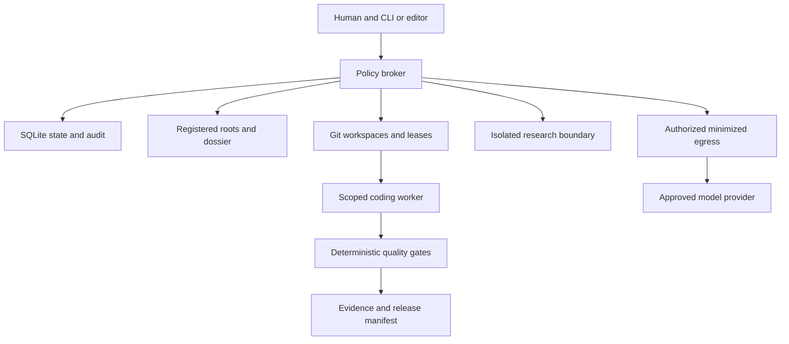
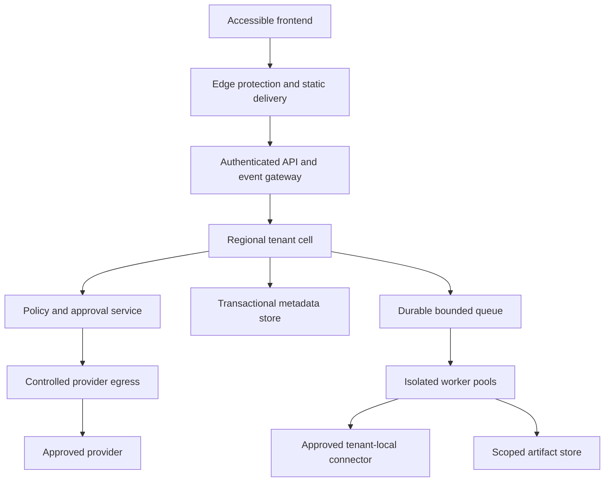

# Architecture

## Current local foundation

The [entry point](../hub.py) loads [src/hybrid_hub](../src/hybrid_hub/).
The broker coordinates work without giving models unrestricted ambient access.

| Responsibility | Source modules |
|---|---|
| CLI and execution | `cli.py`, `hub.py`, `orchestrator.py`, `guided.py` |
| Scope and policy | `registry.py`, `topology.py`, `paths.py`, `policy.py`, `modifiers.py` |
| State and ownership | `state.py`, `workspaces.py`, `leases.py` |
| Approval primitives | `task_authority.py`, `approval_authority.py` |
| Workers/routing | `workers.py`, `subscription_worker.py`, `http_api_worker.py`, `model_router.py` |
| Evidence/disclosure | `quality.py`, `audit.py`, `dossier.py`, `egress.py`, `research_worker.py` |
| Operational interfaces | `operations.py`, `deploy.py`, `cloud.py` |

This source map identifies components; [status](STATUS.md) records missing gates.

## Invariants for future changes

Register exact roots and reject traversal, symlink and cross-project access.
Treat model output, repository text and fetched pages as untrusted. Separate
unrestricted research from private repositories. Keep credentials out of all
model context. Minimize and authorize egress, including logs and test diagnostics.
Bind approval to identity, action, task, artifact, expiry and policy. Preserve
one writer per resource and reject stale writers. Models cannot waive gates.

## Proposed optional distributed deployment

This is a proposal for self-managed or organization-operated installations.
The browser receives neither infrastructure credentials nor unrestricted
repository access. Local-only projects keep source and worker execution within
their approved environment; shared services receive only permitted projections.

Begin with a modular control service and isolated workers. Split services when
load, privilege, ownership or failure isolation justifies it. Evaluate relational
metadata storage, durable queues and object storage against benchmarks, data
residency, operability and cost. No cloud vendor is mandatory.

## Consistency and migration

The future shared store owns task transitions, memberships, approval consumption,
idempotency records and fencing epochs. Use transactions against double approval,
an outbox for reliable event publication, and worker deduplication. Assume queue
redelivery; external model calls/deployments are not automatically exactly-once.

Artifact metadata binds tenant, task, policy and digest. Recheck authority on
every read/write. Short-lived download URLs are narrowly scoped; object IDs are
not authorization. Cache keys include tenant and authorization context.

Keep the local broker usable while introducing versioned storage/transport
contracts. Rehearse export/import and expand/contract schema migrations with
backup and rollback. Old workers refuse unsupported versions. A distributed
database is not a drop-in replacement for filesystem and lease semantics.

## Configuration ownership

Deployment settings belong in validated configuration, maintained prompts/copy
in versioned data files, and secrets in an approved store. The current tree uses
configuration files and CLI arguments; a complete central-settings audit is
still a roadmap gate. Future model IDs, endpoints, prices, capacities and timeouts
must be configurable without changing business logic.
